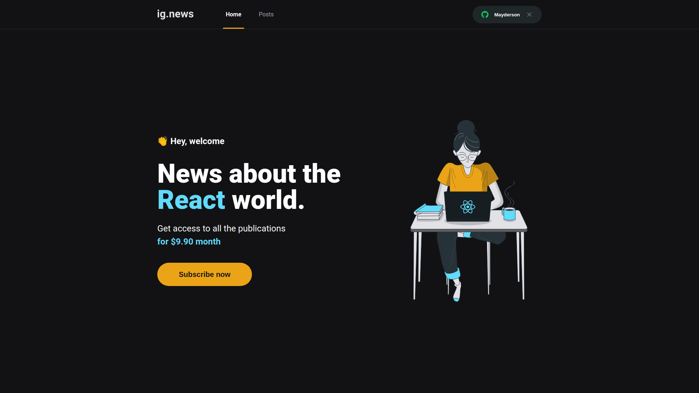
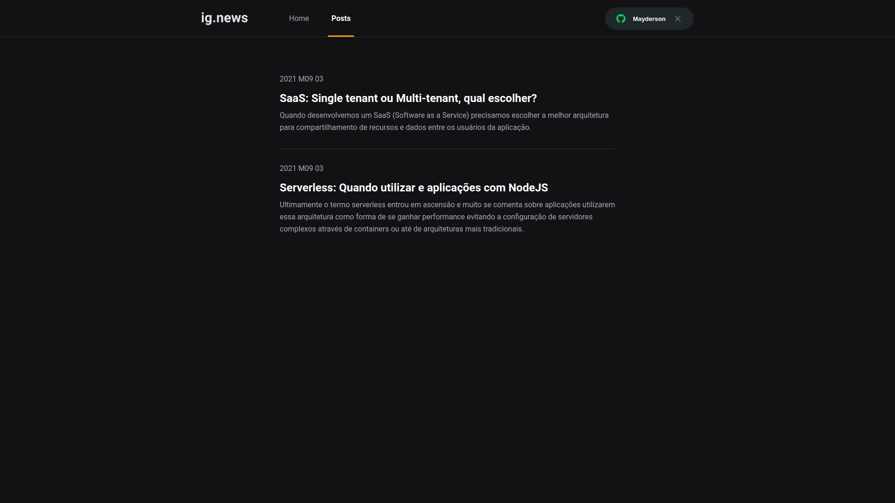
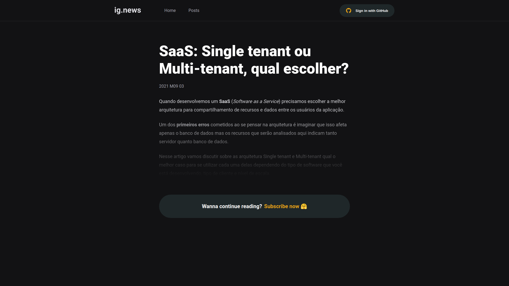

<p align="center">
  
</p>

<p align="center">
  
       
  
</p>

<br />

<p align="center">
  
  
  
</p>

# Ignite Project
Simple subscription-based blog application idea made during Ignite ReactJS.

## 🔨 Features

→ Github OAuth Login/Logout ([**NextAuth.js**](https://next-auth.js.org))

→ Subscription-based blog with [**Stripe**](https://stripe.com) (**Webhooks**) and [**FaunaDB**](https://fauna.com) to save data

→ Served blog posts using [**Prismic CMS**](https://prismic.io)

→ SSG for public pages and SSR private pages (posts) with [**Next.js**](https://nextjs.org)

→ Styled Components & Global Style using [**Styled Components**](https://styled-components.com)

## 🚀 Techs & Tools
→ [**Next.js**](https://nextjs.org)

→ [**Stripe**](https://stripe.com)

→ [**FaunaDB**](https://fauna.com)

→ [**Prismic CMS**](https://prismic.io)

→ [**NextAuth.js**](https://next-auth.js.org)

→ [**TypeScript**](https://www.typescriptlang.org)

→ [**Styled Components**](https://styled-components.com)

## 📄 Documentation
Instructions to be able to create all the necessary environment to run the application

> Create a .env.local file and add the requested environment variables based on the .env.example file in the project root

<details>
<summary>Fauna</summary>

## Create a new account

First create your [Fauna](https://fauna.com) account, then create a new database with a name of your choice, eg **ignews**

## Create collections

Create these collections below:

* subscriptions
* users

## Create indexes

In the section for creating indexes, you must create and configure them as shown below:

- subscription_by_id
  - **Source collection**: subscriptions
  - **Index name**: subscription_by_id
  - **Terms**: data.id
  - **Serialized**: Mark as checked
  
- subscription_by_status
  - **Source collection**: subscriptions
  - **Index name**: subscription_by_status
  - **Terms**: data.status
  - **Serialized**: Mark as checked
  
- subscription_by_user_ref
  - **Source collection**: subscriptions
  - **Index name**: subscription_by_user_ref
  - **Terms**: data.userId
  - **Serialized**: Mark as checked
  
- user_by_email
  - **Source collection**: users
  - **Index name**: subscription_by_user_ref
  - **Terms**: data.email
  - **Unique**: Mark as checked
  - **Serialized**: Mark as checked
  
- user_by_stripe_customer_id
  - **Source collection**: users
  - **Index name**: user_by_stripe_customer_id
  - **Terms**: data.stripe_customer_id
  - **Serialized**: Mark as checked
  
## Create your first key
  
Access the **Security** tab of the Fauna dashboard, select the **New Key** option.
  
* **Database**: Select the one you created
* **Role**: Admin
* **Key Name**: Any name you want eg ignews-next-app

With these steps your **Secret Key** will be displayed, copy it and save it in the **.env.local** file in the variable: **FAUNADB_KEY**
</details>

<details>
<summary>GitHub oAuth App</summary>

## Create oAuth App on GitHub

Access your GitHub account and go to:

> Settings > Developer settings > oAuth Apps

Select **New OAuth App**

* **Application name**: write any name
* **Homepage URL**: http://localhost:3000
* **Application description**: write any description
* **Authorization callback URL**: http://localhost:3000/api/auth/callback

Now copy the **Client ID** to file **.env.local** on variable **GITHUB_CLIENT_ID** and copy **Client secrets** to variable **GITHUB_CLIENT_SECRET**
</details>

<details>
<summary>Stripe</summary>

## Create a new account

First register on [Stripe](https://stripe.com), then create a new account with a name of your choice, eg **ignews**

## Add product

Choose a option **Products** and click on **+ Add Product**

* **Name**: Subscription
* **Description**: write any description
* **Price**: 9.90 | USD
* **Recurring or One time**: Mark Recurring
* **Billing period**: Monthly

Click on **Save Product**

## Copy pricing api

Now copy the API ID of session **Pricing** to the **.env.local** file to variable **STRIPE_PRICING_API**

## Copy keys

In the **Developers** tab, select the **API Keys** option that is presented in the side menu, in this section you must copy the keys into the **.env.local** file

* **Publishable key**: must be copied to the variable **NEXT_PUBLIC_STRIPE_PUBLIC_KEY**
* **Secret key**: must be copied to the variable **STRIPE_API_KEY**

## Webhooks
Now to finish, select the option **Webhooks** which is also found in **Developers**.

You must install the Stripe CLI on your system, on the Webhooks page there will be a button saying **Test in a local environment**, where you will have the step by step to download the CLI.
After downloading and installing the CLI on your system, you should perform the steps below:

> Log in with your Stripe account
```bash
$ stripe login
```
> Forward events to your webhook
```bash
$ stripe listen --forward-to localhost:3000/api/webhooks
```

After running **stripe listen** a message will appear:

> Ready! Your webhook signing secret is ...

You must copy this key and place it in the environment variable **STRIPE_WEBHOOK_SECRET** inside the **.env.local** file

## Other environment variables

There will be two more environment variables that will have to be set in the **.env.local** file, and they need to have these values:

> STRIPE_SUCCESS_URL=http://localhost:3000/posts

> STRIPE_CANCEL_URL=http://localhost:3000
</details>

<details>
<summary>Prismic</summary>

## Create a new account

First create your [Prismic](https://prismic.io) account.

## Create a new repository

In Prismic Dashboard, click in **Create repository**

* **Repository name**: choose any name
* **Display name**: choose any name
* **What is your role/job title?**: Developer
* **What technology do you plan to use in your repository?**: Next.js

Select in **Available plans**: Free

Click on **Create repository**

## Start page

Será perguntado para você: **What’s the main language you will be writing content in?**

Select your preference language, eg: **Portuguese - Brazil**

## Custom type

Click on **Create custom type** then **Repeatable Type**.

**Enter your type name**: Publication

Create 3 fields to compose the structure of a post, just drag the field type to the area where the content is concentrated.

1º UID
* **Field name**: UID

2º Title
* **Field name**: Title
* **It will appear in the entry editor**: Mark only **h1**

3º Rich Text
* **Field name**: Content
* **Allow multiple paragraphs**: Mark all
* **Allow target blank for links**: Select
 
Click on **Save**
 
## Create document

Select the option **Documents** click on the pencil icon to start writing the posts, each post will have the **UID**, **Title** and **Content** just fill in these fields correctly and save them.

## API & Security

Click on the **Settings** option, in the **Configuration** section there will be an option **API & Security** click on it.

In the **API endpoint** copy the **URL** to get their api access and paste in the variable **PRISMIC_ENDPOINT** in the **.env.local** file

In the **Repository security** session change the setting to: **Private API - Require an access token for any request**

Now in the **Generate an Access Token** session:

* **Application name**: write any name eg: ignews-nextjs-app
* **Callback URL**: leave empty

Click on **Add this application**

Copy the token from **Access to master** and paste it into the variable **PRISMIC_ACCESS_TOKEN**
</details>


## 💻 Run project
```bash
# Open terminal and clone this repository
$ git clone https://github.com/Sup3r-Us3r/ignite-project-ignews.git

# Run stripe CLI listener (it is assumed that you already have it installed)
$ stripe listen --forward-to localhost:3000/api/webhooks

# Install dependencies
$ npm install
# or
$ yarn install

# Start the application
$ npm run dev
# or
$ yarn dev
```
